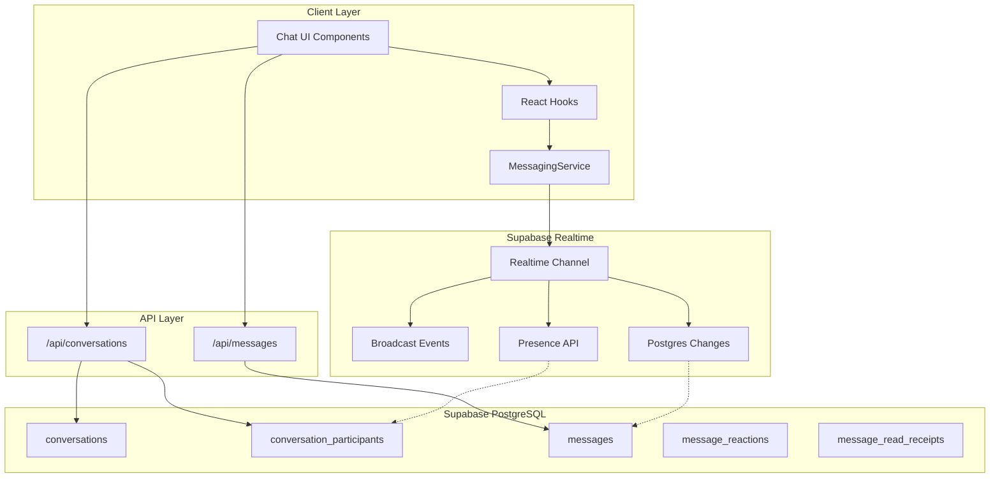
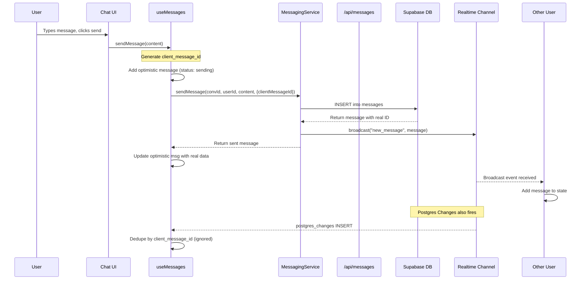
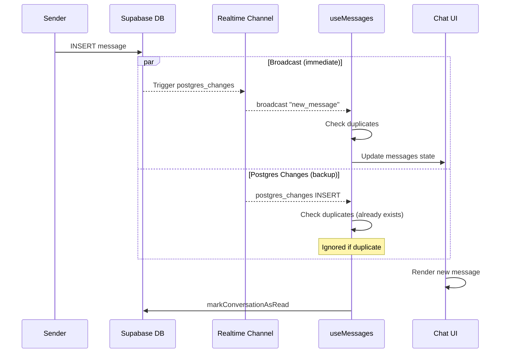
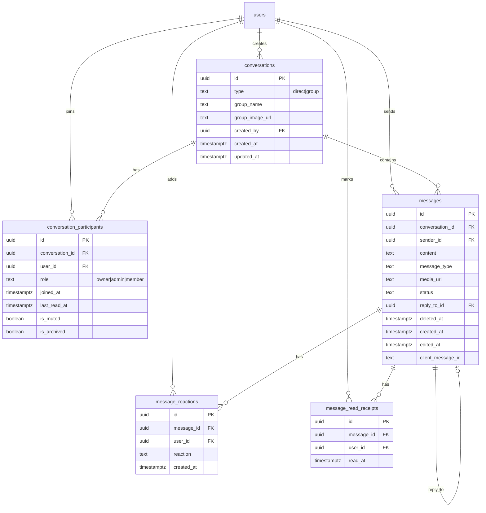
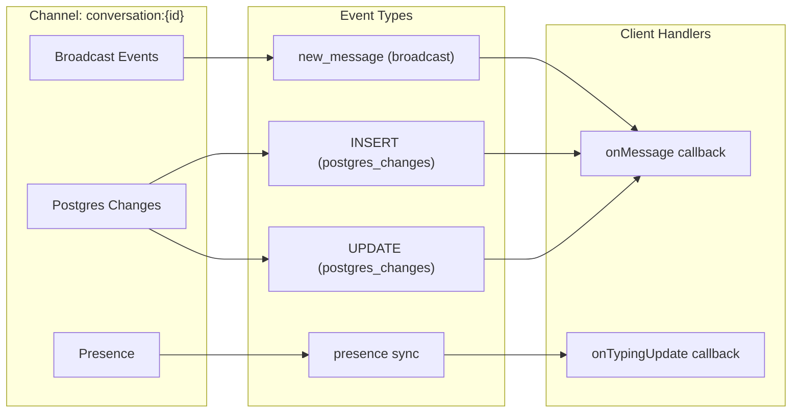
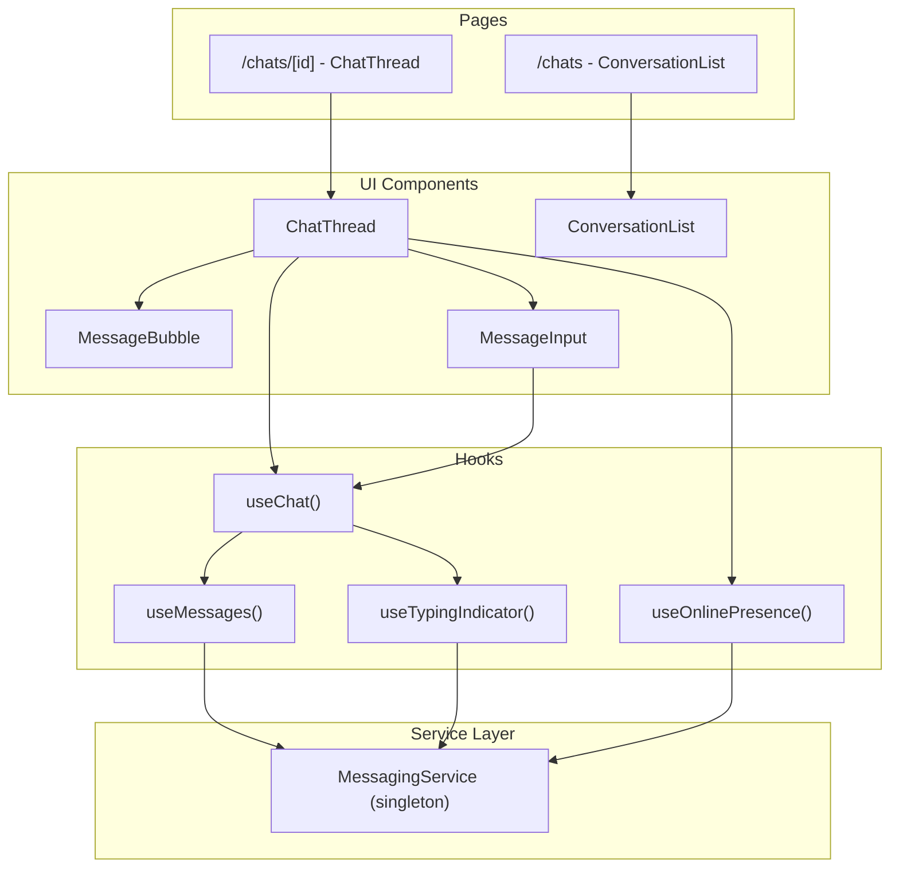
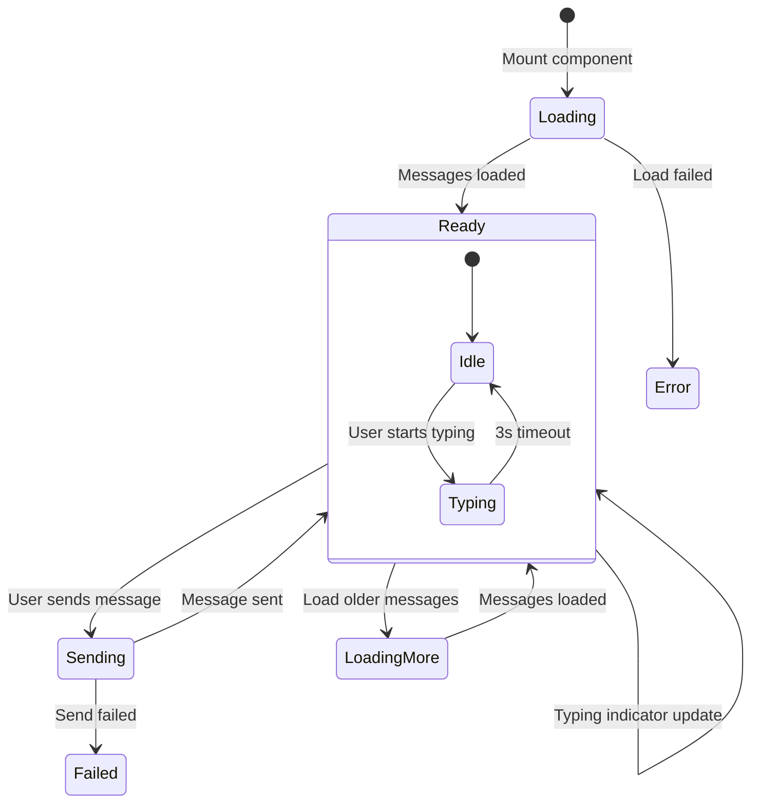
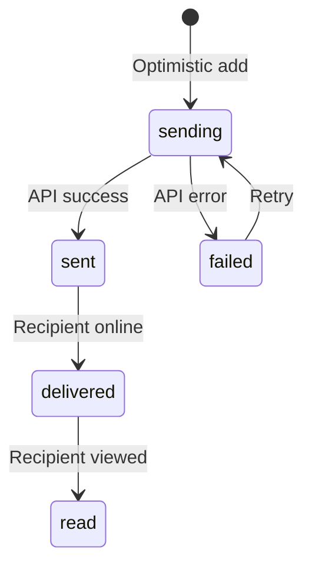

# Messaging System Architecture

## High-Level Overview

## Data Flow: Sending a Message

## Data Flow: Receiving a Message

## Database Schema

## Realtime Channel Architecture

## Component Architecture

## State Management

## Message Status Flow

## Key Design Decisions

### 1. Dual Real-time Channels
- **Broadcast**: Immediate delivery, sender pushes to channel
- **Postgres Changes**: Backup delivery, database triggers push

Why both? Broadcast is faster but can be missed. Postgres changes are reliable but slower.

### 2. Client Message ID Deduplication
Every message gets a `client_message_id` before sending. This allows:
- Matching optimistic updates to real messages
- Preventing duplicates from multiple delivery channels
- Idempotent retries on network failure

### 3. Singleton MessagingService
One service instance manages all channels. Benefits:
- Channel reuse (same channel for messages + typing)
- Centralized cleanup
- Consistent state

### 4. SECURITY DEFINER Function
`is_conversation_participant()` bypasses RLS to check participation. Without this, RLS policies that check participation would cause infinite recursion.

### 5. Soft Deletes
Messages use `deleted_at` instead of hard delete. Allows:
- "Delete for me" (only sender sees deleted_at)
- "Delete for everyone" (content replaced, deleted_for_everyone = true)
- Audit trail
