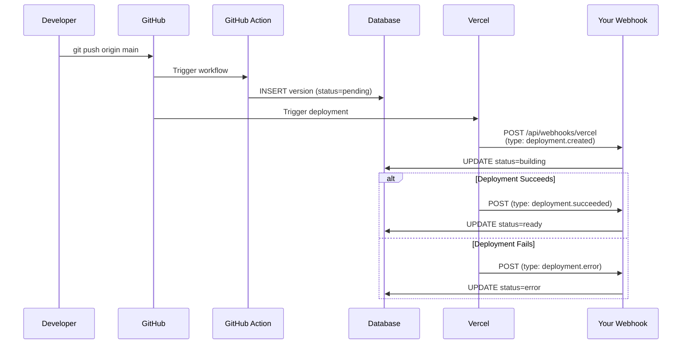

# Vercel Webhook Setup Instructions

## Overview

The version tracking system is now configured to receive deployment status updates from Vercel via webhooks. Follow these steps to complete the setup.

## Step 1: Get Your Domain

Your webhook endpoint URL will be:
```
https://YOUR_DOMAIN.com/api/webhooks/vercel
```

Replace `YOUR_DOMAIN.com` with your actual production domain (e.g., `realsingles.com` or `realsingles.vercel.app`).

## Step 2: Configure Vercel Webhook

1. Go to your Vercel project dashboard
2. Navigate to **Settings** → **Webhooks**
3. Click **Add Webhook**
4. Configure the webhook:
   - **URL**: `https://YOUR_DOMAIN.com/api/webhooks/vercel`
   - **Events**: Select these events:
     - ✅ `deployment.created`
     - ✅ `deployment.succeeded`
     - ✅ `deployment.error`
     - ✅ `deployment.canceled`
   - **Secret**: Leave blank for now (optional, see Step 3)
5. Click **Create Webhook**

## Step 3: Add Webhook Secret (Optional but Recommended)

For security, Vercel can sign webhook payloads:

1. After creating the webhook, Vercel will generate a webhook secret
2. Copy the secret (starts with `whsec_`)
3. Add it to your `.env.local` file:
   ```env
   VERCEL_WEBHOOK_SECRET=whsec_xxxxxxxxxxxxx
   ```
4. Redeploy your application so it picks up the new environment variable

**Note**: Without the secret, webhooks will still work but won't be verified for authenticity.

## Step 4: Test the Webhook

1. Make a small change to your code
2. Run: `pnpm ship "test: webhook integration"`
3. Wait for the deployment to complete
4. Check the admin dashboard at `/admin/settings/app-version`
5. You should see:
   - The version status change from "Pending" → "Building" → "Deployed"
   - A "View" link to the Vercel deployment

## Troubleshooting

### Webhook not updating status

1. **Check Vercel webhook logs**:
   - Go to Vercel Settings → Webhooks
   - Click on your webhook
   - View the delivery logs
   - Look for failed deliveries or errors

2. **Check your application logs**:
   - The webhook endpoint logs to console
   - Look for errors in Vercel function logs

3. **Verify the webhook URL**:
   - Make sure it matches your production domain
   - The endpoint is: `/api/webhooks/vercel` (no trailing slash)

### Status stuck on "Pending"

- The webhook might not be reaching your application
- Check that the webhook is configured for the correct events
- Verify the webhook URL is correct and accessible

### "Invalid signature" errors

- The webhook secret in `.env.local` doesn't match Vercel's secret
- Copy the secret again from Vercel dashboard
- Redeploy the application

## How It Works



## What's Tracked

Each deployment now tracks:

- **deployment_status**: `pending` → `building` → `ready`/`error`/`canceled`
- **vercel_deployment_id**: Unique Vercel deployment ID
- **vercel_deployment_url**: Direct link to the deployment
- **deployment_error**: Error message if deployment fails

## Benefits

1. **Real-time status**: See deployment progress in admin dashboard
2. **Failed deployment alerts**: Quickly identify when deployments fail
3. **Deployment history**: Complete audit trail of all deployments
4. **Direct links**: Jump directly to specific deployments in Vercel
